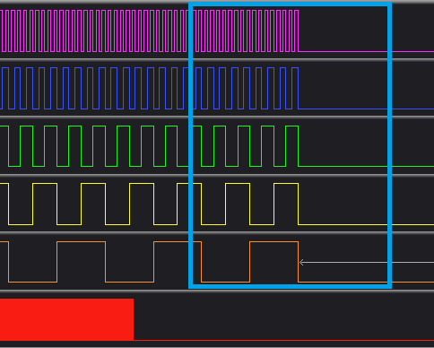
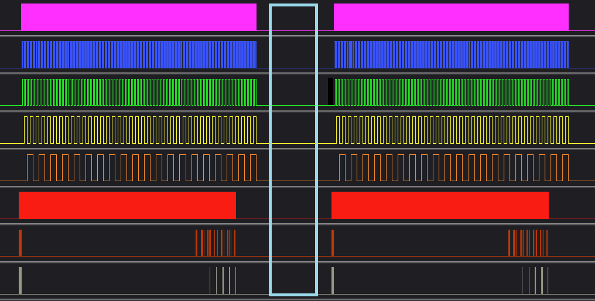
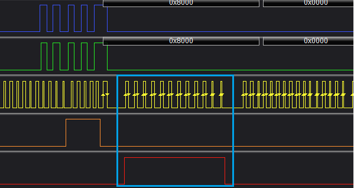
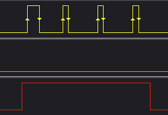
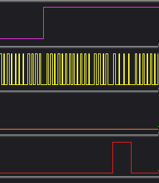
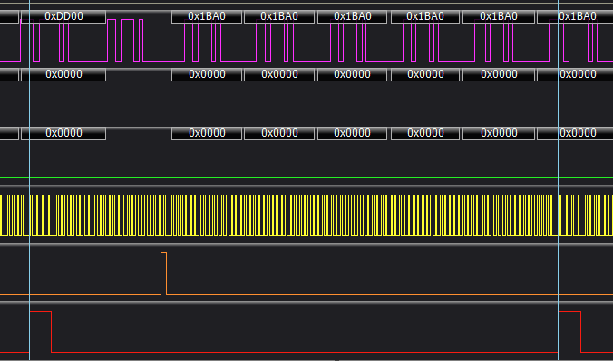
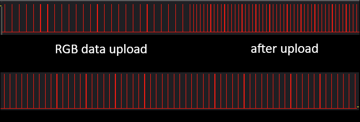
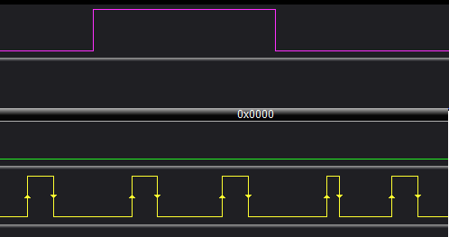
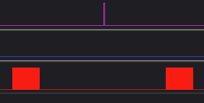

# S-PWM Display Guide

To obtain the best results from the new S-PWM displays, the below cmdline.txt modification is required, this helps with intermittent flicker.
```
nano /boot/firmware/cmdline.txt

# Add the below to the end of the long string.
 isolcpus=domain,managed_irq,2,3 nohz_full=2,3 rcu_nocbs=2,3 irqaffinity=0,1 idle=poll
```

Also it is highly recommended to **ensure you are running with a Real Time kernel.**
[Real Time Kernel Setup Guide](/RT-kernel/README.md)

Currently tested SPWM displays.

FM6373 / DP32019B - 128x64 \
FM6363 / DP32020A - 128x64 \
FM6353 \
SM16380SH - 128x64 \
ICND1065L / 5958 - 172x86 - slight display issue in some use cases

[Further discussion for SPWM panels](https://github.com/hzeller/rpi-rgb-led-matrix/issues/1866).

---

The parameters are by default tuned to Raspberry Pi 4, for other devices, examples settings for Pi 3 / Zero 2W below.

The main parameter to adjust for performance tweaking is adding the below to the beginning of your command. Try adjusting this, lower will give better performance, but higher might be required to give a better image.\
**SPWM_END_OF_FRAME_EXTRA_ROW_CYCLES=1**

**Important - minimum GPIO slowdown** It might work on lower settings but the display registers can not be clocked in accurately.

**--led-slowdown-gpio=5** - Pi 4 \
**--led-slowdown-gpio=3** - Pi 3 / Zero 2W \
**--led-slowdown-gpio=0 or 1** - Pi 5

NOTE **--led-show-refresh** may cause some glitches, so disable this once you have finished testing. Seen on SM16380SH

NOTE **--led-spwm-register-config** | Some drivers like the SM16380SH an alternative register block for 07 is added. This can help with timing on different Pi models. So test both =1 and =0 if you notice any display glitches.

---

### How to run S-PWM panels

**Recommended to use --led-limit-refresh=60**

--led-spwm-row-addr-type=0 - DP32019B Direct \
--led-spwm-row-addr-type=1 - DP32020A Shift Register
--led-spwm-row-addr-type=2 - DP32020A Shift Register Variation

**Don't worry about flicker as S-PWM devices have an internal refresh rate much higher, it is only the frame content changes when we refer to for 60fps**

Assuming Hzeller library is installed in /opt/rpi-rgb-led-matrix

Pi 4 - FM6373 / DP32019B 128x64 Example


    taskset -c 2 chrt -f 99 /opt/rpi-rgb-led-matrix/examples-api-use/demo -D8 --led-rows=64 --led-cols=128 --led-scan-mode=0 --led-gpio-mapping=regular --led-brightness=50 --led-slowdown-gpio=5 --led-pwm-bits=11 --led-limit-refresh=60 --led-no-busy-waiting --led-panel-type=fm6373 --led-spwm-row-addr-type=0

Pi 4 - FM6363 / DP32020A 128x64 Example

    taskset -c 2 chrt -f 99 /opt/rpi-rgb-led-matrix/examples-api-use/demo -D8 --led-rows=64 --led-cols=128 --led-scan-mode=0 --led-gpio-mapping=regular --led-brightness=50 --led-slowdown-gpio=5 --led-pwm-bits=11 --led-limit-refresh=60 --led-no-busy-waiting --led-panel-type=fm6363 --led-spwm-row-addr-type=1

Pi 4 - ICND1065L 172x86 Example

    taskset -c 2 chrt -f 99 /opt/rpi-rgb-led-matrix/examples-api-use/demo -D8 --led-rows=86 --led-cols=172 --led-scan-mode=0 --led-gpio-mapping=regular --led-brightness=50 --led-slowdown-gpio=5 --led-pwm-bits=11 --led-limit-refresh=60 --led-no-busy-waiting --led-panel-type=icnd1065l --led-spwm-row-addr-type=2 --led-spwm-scan=43

Pi 4 - SM16380SH 128x64 Example

    taskset -c 2 chrt -f 99 /opt/rpi-rgb-led-matrix/examples-api-use/demo -D8 --led-rows=64 --led-cols=128 --led-scan-mode=0 --led-gpio-mapping=regular --led-brightness=50 --led-slowdown-gpio=3 --led-pwm-bits=11 --led-limit-refresh=60 --led-no-busy-waiting --led-panel-type=sm16380sh --led-spwm-row-addr-type=0

    ### If you notice any display glitches, you can try an alternative register block --led-spwm-register-config=1
    taskset -c 2 chrt -f 99 /opt/rpi-rgb-led-matrix/examples-api-use/demo -D8 --led-rows=64 --led-cols=128 --led-scan-mode=0 --led-gpio-mapping=regular --led-brightness=50 --led-slowdown-gpio=3 --led-pwm-bits=11 --led-limit-refresh=60 --led-no-busy-waiting --led-panel-type=sm16380sh --led-spwm-row-addr-type=0 --led-spwm-register-config=1

Pi 3 - FM6373 / DP32020A 128x64 Example

    SPWM_END_OF_FRAME_EXTRA_ROW_CYCLES=2 taskset -c 2 chrt -f 99 /opt/rpi-rgb-led-matrix/examples-api-use/demo -D8 --led-rows=64 --led-cols=128 --led-scan-mode=0 --led-panel-type=fm6373 --led-gpio-mapping=regular --led-brightness=50 --led-slowdown-gpio=3 --led-pwm-bits=11 --led-limit-refresh=60 --led-no-busy-waiting

Pi 5 - SM16380SH / Shift Register row selector 128x64 Example

    taskset -c 2 chrt -f 99 /opt/rpi-rgb-led-matrix/examples-api-use/demo -D3 --led-rows=64 --led-cols=128 --led-scan-mode=0 --led-gpio-mapping=regular --led-brightness=50 --led-slowdown-gpio=1 --led-pwm-bits=11 --led-limit-refresh=60 --led-no-busy-waiting --led-panel-type=sm16380sh --led-spwm-row-addr-type=1 --led-rp1-pio=0    

Pi 5 - FM6363 / DP32020A 128x64 Example

    taskset -c 2 chrt -f 99 /opt/rpi-rgb-led-matrix/examples-api-use/demo -D3 --led-rows=64 --led-cols=128 --led-scan-mode=0 --led-gpio-mapping=regular --led-brightness=50 --led-slowdown-gpio=0 --led-pwm-bits=11 --led-limit-refresh=60 --led-no-busy-waiting --led-panel-type=fm6363 --led-spwm-row-addr-type=1 

---

**Below are a list of environment variables that can be entered at the beginning of the command to tweak the settings.**


    SPWM_END_OF_FRAME_EXTRA_ROW_CYCLES=3 /opt/rpi-rgb-led-matrix/examples-api-use/demo -D4

[SPWM_END_OF_FRAME_EXTRA_ROW_CYCLES](#spwm_end_of_frame_extra_row_cycles3) \
[SPWM_FRAME_END_SLEEP_US](#spwm_frame_end_sleep_us300)

For example if you reduce the framerate of an FM6373 from 100 (default) to 60, 
--led-limit-refresh=60 \
use led-show-refresh to monitor the framerate. You can keep increasing SPWM_END_OF_FRAME_EXTRA_ROW_CYCLES to fill the gaps until the framerate starts to reduce below the limit. That would then be too many cycles, so start reducing the number then.


**The options below would not be needed to be changed by users.**

[SPWM_FIRST_OE_CLK_LENGTH](#spwm_first_oe_clk_length12) \
[SPWM_OE_CLK_LENGTH](#spwm_oe_clk_length4) \
[SPWM_OE_CLK_LOOK_BEHIND](#spwm_oe_clk_look_behind16) \
[SPWM_RGB_UPLOAD_LAT_SPACER_CLK_COUNT](#spwm_rgb_upload_lat_spacer_clk_count0) \
[SPWM_OE_DURING_UPLOAD_CLK_COUNT](#spwm_oe_during_upload_clk_count112) \
[SPWM_OE_AFTER_UPLOAD_CLK_COUNT](#spwm_oe_after_upload_clk_count112) \
[SPWM_AUTO_TUNE_OE_GAPS](#spwm_auto_tune_oe_gaps1) \
[SPWM_AUTO_TUNE_FRAMES](#spwm_auto_tune_frames50) \
[SPWM_AUTO_TUNE_MAX_STEP_CLKS](#spwm_auto_tune_max_step_clks50) \
[SPWM_SHIFT_REG_ROW_SELECT_A_PULSE_CLK_COUNT](#spwm_shift_reg_row_select_a_pulse_clk_count2) \
[SPWM_SHIFT_REG_ROW_SELECT_A_PULSE_START_CLK](#spwm_shift_reg_row_select_a_pulse_start_clk0) \
[SPWM_SHIFT_REG_ROW_SELECT_A_PULSE_CENTERED](#spwm_shift_reg_row_select_a_pulse_centered1) \

---

Values are just examples from FM6373 --led-spwm-row-addr-type=0 where applicable

#### SPWM_END_OF_FRAME_EXTRA_ROW_CYCLES=3
Extra row cycles after the RGB upload at the end of every frame. \



#### SPWM_FRAME_END_SLEEP_US=300
Gap in US between frames. \


#### SPWM_FIRST_OE_CLK_LENGTH=12
For --led-spwm-row-addr-type=0 \


#### SPWM_OE_CLK_LENGTH=4
OE CLK length of normal OE pulses \


#### SPWM_OE_CLK_LOOK_BEHIND=16
Offset of CLKs when first row selection Channel A is pulsed in relation to OE pulse For direct row selection e.g FM6373 applies to --led-spwm-row-addr-type=0 \


#### SPWM_RGB_UPLOAD_LAT_SPACER_CLK_COUNT=0
Adds LAT-low, RGB-blank spacer CLKs after each normal RGB upload LAT pulse.

#### SPWM_OE_DURING_UPLOAD_CLK_COUNT=112
Change how many CLKS an OE pulse occurs on during the RGB upload. Auto Tune will use this as the base and adjust SPWM_OE_AFTER_UPLOAD_CLK_COUNT \


#### SPWM_OE_AFTER_UPLOAD_CLK_COUNT=112
Overrides AUTO_TUNE \
Change how many CLKS an OE pulse occurs on during the RGB upload

---

#### SPWM_AUTO_TUNE_OE_GAPS=1
Only applies to --led-spwm-row-addr-type=0 \
OE channel row selection pulse tuning will automatically make the gaps consistent between the RGB data upload and after upload. \
SPWM_OE_DURING_UPLOAD_CLK_COUNT \
SPWM_OE_AFTER_UPLOAD_CLK_COUNT \

As the CLK rate is faster after the RGB upload \



#### SPWM_AUTO_TUNE_FRAMES=50
Only applies to --led-spwm-row-addr-type=0 \
How many frames to reference to calculate auto tune of: \
SPWM_OE_DURING_UPLOAD_CLK_COUNT \
SPWM_OE_AFTER_UPLOAD_CLK_COUNT \

#### SPWM_AUTO_TUNE_MAX_STEP_CLKS=50
Only applies to --led-spwm-row-addr-type=0 \
Maximum CLKS to adjust by from auto tune.


---

#### SPWM_SHIFT_REG_ROW_SELECT_A_PULSE_CLK_COUNT=2
Applies to --led-spwm-row-addr-type=1 and --led-spwm-row-addr-type=2 \
Channel A pulse CLK length for Shift Reg multiplexer \


#### SPWM_SHIFT_REG_ROW_SELECT_A_PULSE_START_CLK=0
Applies to --led-spwm-row-addr-type=1 and --led-spwm-row-addr-type=2 \
Start CLK offset for the Channel A pulse when centering is disabled. \

#### SPWM_SHIFT_REG_ROW_SELECT_A_PULSE_CENTERED=1
Applies to --led-spwm-row-addr-type=1 and --led-spwm-row-addr-type=2 \
Shift Reg centre Channel A pulse between OE pulses. \



---
